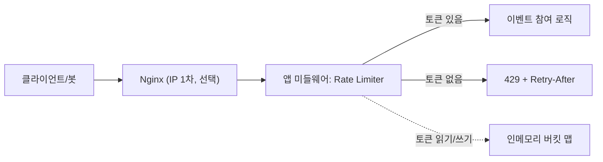

# 4. 처리율 제한 장치 (소규모)
## 0. 고민하기

- 미리 고민해보기
    - 어떤 api를 제한할지
    - 초과하면 어떻게 응답할지
    - 규모 추정 (qps, 서버)
    - 알고리즘
    - 어디에 둘지
    - 카운터 어디에 저장할지
    - 병목 지점

## 1. 문제 정의 & 설계 범위 확정

- 서비스: 야구보구 (야구 직관 플랫폼) 의 `선착순 100명 시즌 응원키트 신청 이벤트`
- 핵심 사용자: 로그인한 야구보구 유저 (이벤트 참여자)
- 핵심 기능
    - 이벤트 참여 API (POST `/events/{id}/apply`)에 처리율 제한 적용
    - 이벤트 오픈시 봇, 매크로 폭주로부터 서버 1대의 자원(CPU·DB 커넥션) 보호
- 제외할 범위 (rate limiter와 관련 없는 부분)
    - 재고 100개 초과 방지(동시성/원자적 차감)
    - 중복 신청 방지(멱등성/유니크 제약)
    - 봇 차단(CAPTCHA·계정인증)
- 제약사항
    - 서버 1대(개인 규모)
    - 로그인 기반이라 계정 단위 식별 가능

**품질 우선순위**

- 1순위: `가용성`: 오픈 순간 트래픽 폭주에도 서버가 죽지 않을 것
- 2순위: `공정성`: 특정 사용자나 봇이 api를 독점하지 않도록 함
- 3순위: `운영` 단순성: 개인 프로젝트 규모에 맞게 구현과 운영이 쉬워야 한다.
- 허용 가능한 희생: 정확도
    - 요청을 정확히 N번까지 허용하지 않아도 된다. (99번에서 막히든 101번에서 막히든 상관X)

**규모**

- DAU: 1,000 가정
- 평균 QPS: 약 0.12 QPS
    - 하루 총 요청 1,000 * 10회 / 86,400 = 0.12 QPS
- Peak QPS: 관심 유저 약 800명이 오픈 1-2초에 몰리면 순간 Peak 약 400~ 800 QPS
- 읽기 : 쓰기: 쓰기 위주 연산
    - rate limiter는 인메모리 버킷 읽고 갱신함, DB 부하 X
- 데이터 증가량: 활성 계정마다 버킷 1개
- 데이터 보존 기간: 버킷 상태는 휘발성(메모리)이므로 안쓰는 엔트리는 폐기 가능
- 확인 질문
    - 가장 중요한 사용자 흐름은?
        - 이벤트 참여 api
    - 실시간 처리가 필요한가?
        - 필요함, 비동기 불가능
    - 데이터 손실이나 중복을 허용할 수 있는가?
        - rate limiter 카운터는 손실, 오차 허용
        - 이벤트 신청 중복은 `unique`로 막아야함
    - 일관성은 어느 수준까지 필요한가?
        - 서버 1대이므로 일관성 확보됨
    - 특정 기술이나 기존 인프라를 활용해야 하는가?
        - redis는 아직 없으므로 인메모리 활용 가능

## 2. 개략 설계안 제시 & 동의 구하기

- 핵심 흐름: 요청 → (앱 미들웨어) rate limiter가 계정 버킷 확인 → 토큰 있으면 통과, 없으면 429 → 통과 시 이벤트 참여 로직 실행
- API: POST `/events/{id}/apply` (헤더에 계정 인증)
    - 초과 시 429 Too Many Requests + Retry-After 헤더
- 데이터 모델: { `계정ID`: `{ tokens, lastRefillAt }` } 형태의 인메모리 맵
    - `tokens` : 남은 토큰 수
    - `lastRefillAt` : 마지막으로 토큰 채운 시각
- 주요 컴포넌트: 앱 미들웨어(rate limiter) + 인메모리 저장소
- 다이어그램:



- 개략적 추정
    - 선착순은 평균 `QPS`(약 10,000÷86,400≈0.12)보다 오픈 순간 동시 접속이 중요하다.
    - 관심 유저가 약 800명이 오픈 1-2초에 동시에 시도한다면, 순간 약 400-800 QPS가 발생한다.

> 설계 방향을 설명한 뒤 면접관과 범위를 맞춘다.
> 
- Go deeper
    - **가장 중요한 요청 흐름**: 오픈 순간의 이벤트 참여 요청
        - `POST /apply → 미들웨어(토큰 판정) → 참여 로직` 경로
    - **가장 먼저 발생할 병목**
        - cpu 포화 : 요청마다 드는 기본 비용(연결·TLS·파싱·인증) × 초당 수백~수천 건의 요청
        - 버킷 맵 동시성 (Lock): 버킷 맵을 두고 lock을 기다리면 cpu가 대기, 컨텍스트 스위칭으로 더 나빠짐
    - **단일 장애 지점(`SPOF`)**: 서버 1대
        - 서버 여러 대 + Redis로 가면 해소된다.
    - **읽기와 쓰기 확장 방식**: 지금은 서버 1대라 확장하지 않는다.
        - 트래픽이 커지면 읽기·쓰기가 모두 인메모리라 서버를 늘리면 카운터가 서버마다 존재해 값이 어긋난다. 따라서 Redis로 카운터를 중앙화해 모든 서버가 같은 값을 읽고 쓰게 만들면 된다.
    - **주요 실패 시나리오**:
        - rate limiter 자체 오류·지연
            - `fail-open`: rate limiter가 죽으면 요청 모두 통과시킴
            - `fail-close`: rate limiter가 죽으면 모든 요청이 다 막힘
            - 기본적으로는 fail-open으로 설정하여 이벤트 참여를 방해하지 않음
        - 서버 재시작되면 인메모리이므로 버킷 상태가 유실되고 봇의 한도가 리셋되어 다시 요청을 할 수 있다.
        - 봇의 계정 우회 → 계정 여러 개로 나눠서 보내면 계정당 제한이 뚫릴 수 있다. `CAPTCHA`(사람인지 확인) 하는 등의 상위 방어가 필요하다.

## 3. 핵심 설계 결정 (Decision Log)

- **Decision #1) 알고리즘: 토큰 버킷(Token Bucket) 선택**
    - 결정: `토큰 버킷` 알고리즘 사용
    - 해결하려는 문제: 이벤트 오픈시 봇의 요청 폭격은 막되, 정상 유저의 순간 클릭(버스트)은 통과시켜야 한다.
    - 선택 이유: 버스트 허용 + 구현 쉬움(Lazy Refill) + 메모리 적음(토큰 수 + 충전 시각)
        - 각 방식별 저장하는 데이터
            
            
            | **알고리즘** | **키별 저장 데이터** | **메모리** |
            | --- | --- | --- |
            | Fixed Window | 카운터 + 만료 시간 | 매우 적음 |
            | Token Bucket | 토큰 수 + 충전 시각 | 적음 |
            | Sliding Window Counter | 구간별 카운터 | 적음 |
            | Sliding Window Log | 모든 요청 시각 | 많음 |
        - `Lazy Refill`
            
            요청 시점에 경과 시간을 계산해 토큰을 충전함
            
    - 재검토 조건: 현재는 순간적인 요청 증가를 허용해도 되므로 토큰 버킷을 사용한다. 하지만 나중에 DB가 버스트를 견디지 못하고 반드시 초당 일정한 요청만 받아야 한다면(ex) 외부 API, 무거운 쿼리), 요청을 큐에 쌓고 일정 속도로 전달하는 누출 버킷을 검토한다.
    
    | 알고리즘 | 한 줄 설명 | 장점 | 단점 | 선택 안 한 이유 |
    | --- | --- | --- | --- | --- |
    | **`토큰 버킷`** | 토큰이 일정 속도로 채워지고 요청마다 1개 소비 | 버스트 허용, 구현 쉬움, 메모리 적음 | 파라미터 2개(용량·리필률) 튜닝 필요 | — (선택함) |
    | `누출 버킷` | 큐에 쌓고 일정 속도로만 빠져나감 | 출력 속도 일정, 다운스트림 보호 | 버스트 못 받음, 오래된 요청이 큐 점유 | 선착순은 `순간 버스트를 통과`시켜야 해 부적합 |
    | `고정 윈도우 카운터` | 고정 시간 구간별 요청 수 카운트 | 제일 단순, 메모리 최소 | `경계 문제(`구간 경계에서 2배 통과) | 오픈 순간이 경계에 몰리면 한계 이상으로 요청을 받음 |
    | `슬라이딩 윈도우 로그` | 요청 타임스탬프 저장 후 윈도우 내 개수 계산 | 정확함, 경계 문제 없음 | 메모리 많이 쓰임(타임스탬프 전부 저장) | 개인 규모엔 과함, 메모리 낭비 |
    | `슬라이딩 윈도우 카운터` | 고정 윈도우 + 이전 구간 가중 근사 | 경계 완화 + 메모리 절약, 정확히 N번 제한하고싶을때(ex) 로그인) | `근사값`이라 완벽히 정확하진 않음 | 토큰 버킷보다 버스트 요청 처리가 되지 않으므로 사용자 경험이 좋지 않음 |
    - 토큰 버킷 vs 슬라이딩 윈도우 카운터
        
        
        | **Sliding Window Counter** | **Token Bucket** |
        | --- | --- |
        | 공정한 제한 | 버스트 허용 |
        | 보안 API | 일반 서비스 API |
        | 로그인, OTP, 회원가입 | 검색, 조회, 광고 수정 |
        | 정확히 N번 | 평균 N번 |
    - 누출 버킷
        
        Leaky Bucket은 요청을 일정한 속도로 처리하기 때문에 Token Bucket보다 지연이 발생할 수 있어 사용자 경험은 다소 떨어질 수 있습니다. 
        
        대신 DB나 외부 API처럼 순간적인 트래픽을 감당하기 어려운 다운스트림을 안정적으로 보호할 수 있다는 장점이 있습니다. 
        
        그래서 일반 사용자 API에는 Token Bucket을, 다운스트림 보호가 더 중요한 경우에는 Leaky Bucket을 선택하는 경우가 많습니다.
        
- **Decision #2) 저장 위치: 인메모리**
    - 해결하려는 문제: 계정별 토큰 수·마지막 리필 시각을 어디에 둘지
    - 결정: 버킷 상태를 앱 프로세스의 인메모리 맵(`ConcurrentHashMap<String, BucketState>)`에 저장
    - 선택 이유: 서버 1대라 상태 공유할 필요가 없다.
        - 인메모리가 가장 빠르고(네트워크 홉 0) 인프라 추가 없음
    - 대안: Redis:  여러 서버가 카운터를 공유해야 할 때 필요
    - 트레이드오프: 서버 재시작 시 버킷 상태가 유실될 수 있다. 서버가 여러대 되면 rate limiter 동작이 안된다.
    - 재검토 조건: 서버를 2대 이상으로 확장하면 Redis로 이동
    - 구조 예시:
        - `{ "user:123": { tokens: 8.0, lastRefillAt: 1690000000000 } }`
        - 원자적 연산 : 토큰 리필 + 차감을 원자적으로 수행하기 위해 `compute()`를 사용한다. 동일한 key 기준으로 한번에 하나의 스레드만 실행하도록 보장한다.
        
        ```java
        buckets.compute(userId, (key, bucket) -> {
            // 토큰 리필
            // 토큰 차감
            // 새로운 상태 반환
        });
        ```
        
- **Decision #3) 버킷 구조 및 리필 방식**
    - 해결하려는 문제: 계정 간 요청을 어떻게 격리하고, 소모된 토큰을 어떤 방식으로 보충할지
    - 결정:
        - 계정별로 독립된 토큰 버킷 1개를 둔다.
        - 토큰은 요청이 들어올 때만 계산하는 `Lazy Refill` 방식을 사용한다.
    - 선택 이유:
        - 계정별 버킷을 사용하면 특정 계정의 과도한 요청이 다른 계정의 요청 한도에 영향을 주지 않는다.
        - `Lazy Refill`을 사용하면 모든 버킷을 주기적으로 순회하며 토큰을 채우는 백그라운드 작업이 필요 없다.
        - 요청 시점에 경과 시간만 계산하면 되므로 구현이 단순하고 불필요한 CPU 사용을 줄일 수 있다.
    - 파라미터:
        - `capacity`: 버킷에 저장할 수 있는 최대 토큰 수, 허용 가능한 최대 버스트 크기
        - `refillRate`: 초당 보충되는 토큰 수
    - 처리 방식:
        - 요청이 도착하면 마지막 갱신 이후 경과 시간을 계산한다.
        - `elapsed = now - lastRefillAt`
        - `tokens = min(capacity, tokens + elapsed × refillRate)`
        - `lastRefillAt = now`
        - 토큰이 1개 이상이면 1개를 차감하고 요청을 허용한다.
        - 토큰이 부족하면 요청을 거부하고 `429 Too Many Requests`를 반환한다.
    - 대안:
        - 공용 버킷: 구현은 단순하지만 한 계정의 과도한 요청이 다른 정상 계정까지 차단할 수 있다.
        - 주기적 리필: 요청 시 계산(Lazy Refill)이 아니라 토큰을 주기적으로 보충하는 방식도 가능하다. 구현은 직관적이지만, 요청이 없는 버킷까지 계속 갱신해야 하므로 불필요한 CPU 사용이 발생한다.
    - 트레이드오프:
        - 계정 수만큼 버킷 상태를 저장해야 하므로 메모리 사용량이 증가한다.
        - Lazy Refill은 토큰이 실제로 일정 주기마다 저장되는 것이 아니라, 요청 시점에 경과 시간을 바탕으로 계산된다.
        - 요청이 동시에 들어오면 토큰 보충과 차감 과정이 원자적으로 처리되어야 한다.
    - 재검토 조건:
        - 계정별 제한이 아니라 전체 시스템 처리량을 제한해야 하면 `전역 버킷`을 추가한다.
        - 계정 수가 크게 증가해 메모리 사용량이 문제가 되면 만료 정책이나 Redis 저장을 검토한다.
        - 다운스트림으로 요청을 일정한 속도로 전달해야 하면 `누출 버킷`이나 `작업 큐`를 검토한다.
    - 예시:
        - `capacity = 10`, `refillRate = 5 tokens/s`
        - 토큰이 가득 찬 상태에서 20개의 요청이 동시에 들어오면 처음 10개는 통과하고 나머지 10개는 `429`를 반환한다.
        - 이후에는 초당 최대 5개의 토큰이 다시 생기므로 지속적으로는 초당 약 5개의 요청을 허용한다.
- **Decision #4) 제한 위치: 앱 미들웨어 (vs `Nginx`)**
    - 해결하려는 문제: 계정 단위 처리율 제한을 어디서 판정할까?
    - 결정: `Rate limiter`를 앱 `미들웨어`(스프링 필터/인터셉터)에 둔다
    - 선택 이유: 제한 기준이 `계정 단위`라 로그인 정보가 필요하다. 따라서 앱에 두어야한다. Nginx는 IP까지만 알 수 있다.
    - 대안: Nginx `limit_req` 모듈로 앞단에서 IP 단위 제한
    - 트레이드오프: 미들웨어는 요청이 앱까지 들어와야 판정되므로 앱에 부하를 줄 수 있다.
        - Nginx는 앞에서 쳐내 앱 부하가 없지만 계정을 구분할 수 없다.
    - 재검토 조건: 트래픽이 커져 앱 앞에서 미리 걸러야 하면 `Nginx`(IP 1차) + 앱 `미들웨어`(계정 2차) 2단 구성으로 확장할 수 있다.

## 4. 상세 설계

- 집중할 영역: rate limiter 미들웨어 내부(토큰 버킷 판정) + 인메모리 저장소


- 데이터 흐름: 요청 → 계정 key(ex) 사용자 ID) 추출 → 버킷 조회/보충 → 토큰 판정(차감 or 거절) → 요청 통과/거절
- 병목
    - 다수 계정에서 요청이 몰리면 `compute()` 는 병렬처리할 수 있다.
    - 단일 계정에서 요청이 몰리면 hot key가 되어 대기 시간이 증가한다.
- 동시성 / 정합성: 같은 계정의 동시 요청이 버킷을 동시 수정할 경우를 고려하여 원자적 갱신이 필요하다 (락 or `ConcurrentHashMap.compute`)
- 코드
    
    ```java
    AtomicBoolean allowed = new AtomicBoolean(false);
    
    buckets.compute(accountId, (key, bucket) -> {
        BucketState state = bucket == null
                ? BucketState.full(capacity)
                : bucket;
    
        state.refill(System.nanoTime(), refillRate);
    
        if (state.getTokens() >= 1) {
            state.consume(1);
            allowed.set(true);
        }
    
        return state;
    });
    
    return allowed.get();
    ```
    
- 장애 시 동작: rate limiter 오류 시 `fail-open`(통과 허용)
    - 폭주 위험이 크면 fail-close 고려
- 확장 방식: 서버 2대 이상일때 인메모리로는 카운터는 공유할 수 없으므로 `Redis`(INCR/TTL 또는 토큰버킷 Lua)로 이동한다.
- 구현 방식
    
    
    | **방식** | **적합한 알고리즘** | **특징** |
    | --- | --- | --- |
    | `INCR + TTL` | 고정 윈도 카운터 | 단순하고 구현이 쉬움 |
    | Token Bucket Lua | 토큰 버킷 | 버스트 허용, 구현은 더 복잡 |
    | Redis ZSET | 이동 윈도 로그 | 정확하지만 메모리 사용량 큼 |

- Go deeper
    - **CPU / Memory / Disk I/O / Network**
        - **`CPU`**: 토큰 계산 자체는 가볍지만, 이벤트 오픈 순간 요청이 몰리면 토큰 연산이 계속된다. 현재 구조에서는 CPU가 가장 먼저 병목이 될 가능성이 크다.
        - **`Memory`**: 계정마다 버킷 하나를 저장하는 정도이므로 지금 규모에서는 크게 신경 쓰지 않아도 되지만, 계정 수가 많아지면 오래 사용하지 않은 버킷을 제거하는 정책이 필요하다.
        - **Disk / Network**: 현재는 인메모리 방식이라 디스크나 네트워크 접근이 없다. 이후 Redis로 옮기면 요청마다 네트워크 통신 비용이 추가된다.
    - **Connection / Lock / Queue 적체**
        - **`Lock`**: 같은 계정에서 요청이 동시에 들어오면 `compute()`가 해당 키의 버킷을 순서대로 갱신한다. 요청을 반복해서 보내는 계정은 hot key가 되어 대기 시간이 늘어날 수 있다. 다만 버킷이 계정별로 분리되어 있어 다른 계정에는 영향이 크지 않다.
        - **Connection / Queue**: 현재 구조에는 외부 저장소나 작업 큐가 없으므로 커넥션 풀이나 큐 적체 문제는 없다. Redis나 메시지 큐를 도입할 때부터 고려하면 된다.
    - **중복 / 유실 / 순서 보장**
        - 동일 계정의 버킷 갱신을 원자적으로 처리하면 토큰이 동시에 여러 번 차감되는 문제를 막을 수 있다.
        - 서버가 재시작되면 인메모리 상태가 사라져 토큰이 초기화될 수 있다.
        - Redis를 사용하면서 실패한 요청을 재시도할 경우에는 같은 요청이 두 번 실행되어 토큰이 중복 차감되지 않도록 주의해야 한다.
        - 이벤트 신청 자체의 중복은 Rate Limiter가 아니라 DB의 `UNIQUE` 제약이나 멱등성 키로 막아야 한다.
        - 요청 처리 순서는 보장하지 않는다. 선착순 순서는 최종 신청 저장 단계에서 결정된다.
    - **Retry / Timeout / Backpressure**
        - 현재는 Redis나 외부 API 호출이 없어 별도의 재시도나 타임아웃 정책이 필요하지 않다.
        - Redis를 도입한다면 타임아웃을 짧게 설정해 Rate Limiter 때문에 전체 요청이 오래 대기하지 않도록 한다.
        - 처리할 수 있는 양보다 요청이 많이 들어오면 `429 Too Many Requests`를 반환해 더 이상 요청을 받아들이지 않는다. 이것이 현재 구조에서의 backpressure 역할을 한다.
    - **Partitioning / Replication / Failover**
        - 현재는 서버와 저장소가 각각 한 대이므로 파티셔닝이나 복제는 고려하지 않는다.
        - 서버와 Redis를 여러 대로 확장할 때는 Redis 장애 조치, 복제 지연, 키 분산 문제를 함께 검토해야 한다.
        - Redis에 문제가 생기면 기본적으로는 fail-open으로 처리해 이벤트 참여 요청을 통과시킨다. 다만 트래픽 폭주로 서버 장애 가능성이 더 크다면 fail-close도 고려할 수 있다.

## 5. 운영과 마무리

- **설계 요약**: 앱 미들웨어에서 계정별 토큰 버킷을 인메모리로 관리해 서버 한 대의 자원을 보호한다.
- **예상 병목**: 오픈 직후 요청이 몰리면 CPU 사용량이 급증하고, 버킷 맵 접근 시 동시성 경쟁이 발생할 수 있다.
- **트레이드오프**: 인메모리 방식은 빠르고 구현이 단순하지만, 서버가 여러 대가 되면 카운터를 공유할 수 없다. 또한 토큰 버킷 특성상 요청 수를 완벽하게 맞추기보다는 일부 오차를 허용한다.
- **모니터링**: 429 응답 비율, 계정별 차단 횟수, Peak QPS를 확인하고, 특정 계정에서 요청이 급증하면 로그를 통해 봇 여부를 확인한다.
- **장애 대응**: 429 비율이 평소보다 크게 증가하거나 정상 사용자까지 많이 차단되면 알림을 받고 원인을 확인한다.
- **복구 방법**: 버킷 크기나 토큰 리필 속도를 조정하고, 서비스 영향이 크면 일시적으로 fail-open 정책을 적용할 수 있다.
- **트래픽이 10배 늘어난다면**: 서버를 여러 대로 확장하고, 카운터는 Redis에서 관리한다. IP 단위 요청은 Nginx나 API Gateway에서 먼저 제한한다.
- **추가로 고려할 점**: Redis Lua를 이용한 원자적 처리, CAPTCHA 같은 상위 봇 방어, 필요하다면 대기열 도입까지 검토한다.

---

## 컴포넌트 블록

> 사용한 컴포넌트만 복제한다. 컴포넌트 추가 이유는 Decision Log에 추가하기
> 
- Cache
    - 고려할 때: 반복 조회, 높은 읽기 부하, 계산 비용이 큰 데이터
    - 주의할 때: 낮은 적중률, 잦은 갱신, 강한 일관성
    - 캐시 대상:
    - 키 / 크기:
    - 읽기·쓰기 패턴:
    - TTL / 무효화:
    - **Go deeper:** Cache Aside · Read/Write Through · Eviction · Hot Key · Stampede · 장애 시 동작
- Database
    - 고려할 때: 영속 저장, 구조화된 데이터
    - 주의할 때: 정합성 요구, 쓰기 확장 한계
    - 데이터 특성:
    - RDB / NoSQL:
    - 스키마 / 인덱스:
    - 읽기·쓰기 패턴:
    - 일관성 요구:
    - **Go deeper:** Replication · Partitioning · Sharding · Transaction · Hot Partition · Backup · Recovery
- Load Balancer / Scaling
    - 고려할 때: 서버 여러 대, 트래픽 분산
    - 주의할 때: 상태 저장, 세션 고정
    - 확장 대상:
    - L4 / L7:
    - 상태 저장 여부:
    - 확장 기준:
    - **Go deeper:** Health Check · Sticky Session · Auto Scaling · Failover · Connection 관리
- CDN / Object Storage
    - 고려할 때: 정적·미디어 콘텐츠, 전역 접근, 대용량 파일
    - 주의할 때: 개인화 콘텐츠, 잦은 갱신
    - 콘텐츠 유형:
    - 접근 지역:
    - 저장 크기:
    - TTL / Invalidation:
    - **Go deeper:** Origin 장애 · Cache 정책 · 업로드 경로 · Lifecycle · 비용
- Message Queue / Event
    - 고려할 때: 비동기, 버퍼링, 디커플링
    - 주의할 때: 순서 보장, 정확히 한 번, 즉시 응답 경로
    - 생산자 / 소비자:
    - 메시지:
    - 처리 시점:
    - 전달 보장:
    - 순서 요구:
    - **Go deeper:** Retry · DLQ · Idempotency · Consumer Group · Backpressure · 중복 · 유실
- Background Job / Scheduler
    - 고려할 때: 무거운·주기적·나중에 해도 되는 일
    - 주의할 때: 중복 실행, 실패 재처리
    - 실행 조건:
    - 실행 주기:
    - 작업 크기:
    - 실패 처리:
    - 중복 실행 방지:
    - **Go deeper:** Worker · Retry · Timeout · Leader Election · Outbox · 재처리
- API / Communication
    - 고려할 때: 클라이언트·서비스 간 통신 방식 결정
    - 주의할 때: 내부/외부 구분, 멱등성
    - 외부 / 내부 API:
    - 동기 / 비동기:
    - 프로토콜:
    - 인증 / 인가:
    - 멱등성:
    - **Go deeper:** REST · gRPC · GraphQL · WebSocket · Versioning · Rate Limit · Gateway
- Observability
    - 고려할 때: 운영 단계 진입
    - 주의할 때: 알림 과잉, 카디널리티 폭증
    - 핵심 지표:
    - 알림 조건:
    - 로그:
    - 트레이싱:
    - 대시보드:
    - **Go deeper:** RED · USE · SLI/SLO · Incident 대응

---

## 트래픽 증가 기록

> 규모가 커지면서 무엇을 왜 그 순서로 바꿨는지 기록. (시스템마다 순서가 다름)
> 

| 규모/조건 | 현재 병목 | 변경한 설계 | 이 선택을 먼저 한 이유 | 새로 생긴 문제 |
| --- | --- | --- | --- | --- |
| 개인 / 서버 1대 | 없음 | 인메모리 토큰 버킷 | 인프라 추가 없이 가장 단순, 네트워크 홉 0 | 서버 2대 되면 카운터 공유 불가 |
| 스타트업 / 서버 여러 대 | 인메모리 카운터가 서버 간 불일치하여 제한 X | `Redis` 중앙 저장(INCR+TTL 또는 토큰버킷 Lua) | 모든 서버가 같은 카운터를 봐야 정확함 | Redis 단일 장애점·네트워크 홉 추가 |
- 병목은 종류로 말하기
    
    CPU · Memory · Disk IO · Network · DB Connection · Lock · Queue 적체 · Latency
    

---

## 리뷰 체크리스트

- [x]  요구사항과 제외 범위를 먼저 정했는가
- [x]  품질 속성의 우선순위를 정했는가
- [x]  규모를 근거로 설계했는가
- [x]  핵심 흐름부터 설명했는가
- [x]  중요한 결정의 대안과 트레이드오프를 설명했는가
- [ ]  데이터 유실·중복·장애를 고려했는가
- [x]  운영과 확장 방법을 설명했는가
- [ ]  면접관과 중간중간 방향을 맞췄는가

---

## 기타

### **배운 점**

- **Rate Limiter와 대기열은 역할이 다르다.**
    - Rate Limiter는 일정 기준을 넘는 요청을 `429`로 거절하는 역할이다.
    - 대기열은 정상 요청을 순서대로 처리하는 역할이다.
    - 티켓팅처럼 요청이 한꺼번에 몰리는 상황에서는 대기열이 순서를 관리하고, 매크로나 과도한 요청은 Rate Limiter가 막는다.
- **Rate Limiter만으로는 중복 처리를 해결할 수 없다.**
    - Rate Limiter는 요청 횟수를 제한할 뿐이다. 계정당 1회 신청은 DB에서 `UNIQUE` 제약으로, 동일 요청의 중복 실행 방지는 `멱등성 키`로 해결해야 한다.
- **Rate Limiter는 1차 방어 수단이다.**
    - IP나 계정을 바꾸면 우회할 수 있기 때문에 이것만으로 봇을 완전히 막을 수는 없다. 실제 서비스에서는 `CAPTCHA`, 계정 인증, 디바이스 핑거프린팅 같은 추가적인 보안 장치와 함께 사용한다.
- **인메모리 방식은 단일 서버에서는 좋은 선택이다.**
    - 하지만 서버가 여러 대가 되면 요청 횟수를 서버 간에 공유해야 하므로 `Redis` 같은 공용 저장소가 필요하다.
- **Rate Limiter를 어디에 둘지도 요구사항에 따라 달라진다.**
    - IP 기준처럼 단순한 제한은 `Nginx` 같은 프록시에서 처리하는 것이 효율적이고, 로그인한 사용자나 계정별 정책처럼 비즈니스 로직이 필요한 경우에는 `애플리케이션 미들웨어`에서 처리하는 것이 적합하다.
