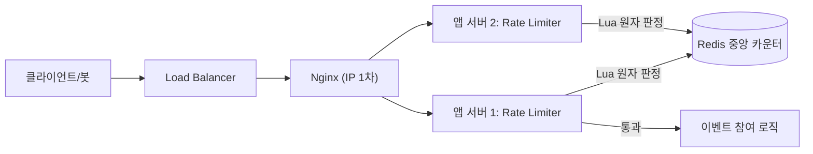

# 4-2. 처리율 제한 장치 (스타트업, 중간 규모)
## 0. 고민하기

- 미리 고민해보기 (소규모 대비 새로 생기는 것)
    - 서버가 여러 대면 카운터를 어디에 둘지
    - 여러 서버가 같은 카운터를 동시에 수정해도 괜찮은지
    - Redis 장애가 나면 어떻게 대응할지
    - Redis를 매 요청마다 호출하는 비용
    - 로드밸런서 앞에서 IP 기준으로 한 번 더 막을지
    - 특정 계정으로 요청이 몰리는 hot key 문제

## 1. 문제 정의 & 설계 범위 확정

- 서비스: 야구보구 선착순 이벤트
- 달라진 전제: 서버 2대 이상(오토스케일), 트래픽이 소규모의 수십 배이상 (수천~수만 QPS)
- 핵심 기능: 이벤트 참여 API 처리율 제한 (소규모 페이지와 동일)
- 제외할 범위 (소규모와 동일)
    - 재고 차감(동시성), 중복 신청(unique), 봇 차단(CAPTCHA) — 소규모 페이지 참고
- 제약사항
    - 서버가 여러 대이므로 상태를 서버 내부 메모리에 둘 수 없다.
    - 공용 저장소로 Redis를 사용할 수 있다.

**품질 우선순위**

1. **가용성 (동일)**
    - 이벤트 오픈 시에도 서비스가 계속 동작해야 한다.
2. **정확성**
    - 서버가 늘어나더라도 제한 횟수가 서버마다 따로 계산되면 안 된다.
    - 여러 서버가 하나의 카운터를 공유해야 한다.
3. **운영 편의성**
    - Redis를 운영해야 하는 부담이 생기므로 구조를 가능한 단순하게 유지한다.

**규모**

- DAU: 수만 ~ 수십만 명
- Peak QPS: 오픈 직후 수천 ~ 수만
- 트래픽 특성
    - 대부분 요청이 이벤트 참여 API로 들어온다.
    - 매 요청마다 `Redis`를 조회하거나 갱신하는 비용이 추가된다.

## 2. 개략 설계안 제시 & 동의 구하기

- 전체 흐름: 요청 → 로드밸런서 → (Nginx IP 1차 제한) → 앱 미들웨어 → Redis 버킷(Lua 원자 처리) → 통과 또는 429
- 데이터 모델: Redis Key `rl:{userId}` → `{ tokens, lastRefillAt }`, Lua 스크립트에서 함께 갱신
- 주요 컴포넌트: 로드밸런서 + 앱 서버 N대 + Redis(공용 카운터)
- 다이어그램:

- Go deeper
    - 가장 중요한 흐름: 여러 서버가 동시에 같은 계정의 버킷을 갱신하는 상황
    - 가장 먼저 생길 병목: Redis 왕복 비용과 특정 계정에 요청이 몰리는 hot key이다. 같은 Key는 Redis에서 순차적으로 처리된다.
    - 새 단일 장애점: Redis, 모든 서버의 Rate Limiter가 영향을 받는다. 그래서 복제, 페일오버, fail-open 전략을 함께 고려해야한다.

## 3. 핵심 설계 결정 (Decision Log)

- **Decision #1) 저장 위치: 인메모리 → Redis 중앙화**
    - 문제: 서버가 여러 대면 인메모리 카운터가 서버마다 따로 관리되어 제한이 정확하지 않다.
    - 결정: 버킷 상태를 R`edis`에 저장하고 모든 서버가 같은 카운터를 사용한다.
    - 이유: 서버가 몇 대가 되더라도 동일한 기준으로 요청을 제한할 수 있다.
    - 트레이드오프: 요청마다 Redis를 호출해야 하고, Redis가 장애 나면 전체 Rate Limiter가 영향을 받는다.
    - 다시 검토할 시점: Redis 한 대로 처리하기 어려운 수준이 되면 `Cluster` 샤딩(userId 기준)을 고려한다.
    
- **Decision #2) 원자성: Lua 스크립트로 한 번에 처리**
    - 문제: 조회 → 리필 → 차감을 각각 수행하면 여러 서버가 동시에 접근할 때 경쟁 조건이 발생할 수 있다.
    - 결정: 리필, 판정, 차감을 하나의 `Lua 스크립트`에서 처리한다.
    - 이유: Redis는 Lua 스크립트를 원자적으로 실행하므로 같은 Key에 대한 동시 요청도 안전하게 처리된다.
    - 대안: `INCR + TTL`(고정 윈도우)
        - 구현은 단순하지만 버스트 트래픽을 처리하기 어렵고 윈도우 경계 문제가 있다.
    - 트레이드오프: Lua 구현은 조금 더 복잡하지만, 토큰 버킷 방식의 장점을 그대로 유지할 수 있다.
    
    | **방식** | **알고리즘** | **특징** |
    | --- | --- | --- |
    | `INCR + TTL` | 고정 윈도우 | 구현이 단순하지만 버스트 처리와 경계 문제에 약함 |
    | **`Token Bucket Lua`** | 토큰 버킷 | 버스트 허용, 원자적 처리 가능 (선택) |
    | `Redis ZSET` | 슬라이딩 윈도우 로그 | 정확하지만 메모리 사용량이 큼 |
- **Decision #3) 알고리즘: 토큰 버킷 유지 (인메모리 compute → Redis Lua)**
    - 이유: 선착순 이벤트는 순간적으로 몰리는 요청을 어느 정도 받아줄 수 있어야 한다(Burst).
    - 변경된 점: 버킷을 관리하는 위치만 `ConcurrentHashMap.compute()`에서 Redis Lua로 바뀌었고, 알고리즘 자체는 그대로 사용한다.
- **Decision #4) 제한 위치: `Nginx`(IP 1차) + 앱 `미들웨어`(계정 2차)**
    - 문제: 모든 요청이 앱과 Redis까지 들어오면 불필요한 부하가 커진다.
    - 결정: Nginx에서 IP 기준으로 먼저 제한하고, 앱에서는 계정 기준으로 다시 제한한다.
    - 이유: 단순한 요청은 앞단에서 걸러내고, 실제 비즈니스 기준은 앱에서 처리하는 것이 효율적이다.
    - (소규모와 차이: 소규모에서는 앱 미들웨어 하나만으로도 충분했다.)
- **Decision #5) Redis 가용성(`SPOF`): 복제 + 페일오버, 장애 시 fail-open**
    - 문제: Redis가 장애 나면 모든 서버가 Rate Limiter를 사용할 수 없다.
    - 결정
        - `Primary`-`Replica` 복제
            - Primary : 읽기/쓰기 담당
            - Replica : Primary 데이터를 계속 복사해 놓는 대기 서버
        - 자동 페일오버(Sentinel 또는 Cluster) 사용
            - Primary 장애시 자동으로 Replica를 새로운 Primary로 승격한다.
        - Redis를 사용할 수 없는 경우에는 `fail-open`으로 처리한다.
    - 트레이드오프: 페일오버 과정에서 일부 카운터가 유실될 수 있고, `fail-open`을 선택하면 장애 동안에는 제한이 느슨해질 수 있다.
    - 대안: 서버 로컬 메모리를 임시로 사용하는 폴백도 가능하지만, 서버마다 카운터가 달라져 정확성을 보장하기 어렵다.

## 4. 상세 설계

- 이번에 자세히 볼 부분: 앱 미들웨어와 Redis 사이에서 이루어지는 원자 처리, 그리고 Redis 장애 대응
- 데이터 흐름: 요청 → 계정 Key 추출 → `Redis Lua` 실행(리필 + 판정 + 차감) → 통과 또는 429
- 병목
    - 요청마다 `Redis`를 호출하므로 네트워크 왕복 비용이 발생한다.
    - 특정 계정으로 요청이 몰리면 `hot key`가 된다.
        - 같은 Key: Redis는 모든 명령을 순차적으로 처리한다. 같은 계정의 요청이 계속 들어오면 해당 Key에 대한 명령이 큐에 쌓여 대기 시간이 길어진다.
        - 다른 Key: 다른 Key도 순차적으로 처리되지만, 요청이 여러 Key에 분산되면 특정 Key에 작업이 몰리지 않아 병목이 잘 발생하지 않는다. (Redis Cluster에서는 서로 다른 Key가 다른 노드에 저장되면 실제로 병렬 처리된다.)
    - 앱 서버가 늘어나면 `Redis 커넥션 수`도 함께 늘어나므로 커넥션 풀 관리가 필요하다.
- 동시성 / 정합성: 리필, 허용 여부 확인, 토큰 차감을 하나의 `Lua 스크립트`에서 처리한다.
    - 여러 서버가 동시에 같은 사용자의 Rate Limiter를 갱신하더라도 Redis가 Lua 스크립트를 원자적으로 실행하기 때문에 중간에 다른 요청이 끼어들 수 없다.
- 장애 대응: Redis 장애 시에는 fail-open으로 처리하고, 평소에는 복제와 fail-over를 통해 장애 가능성을 줄인다.
- 확장: Redis 부하가 커지면 `userId` 기준으로 샤딩하여 처리량을 늘린다.
    - Rate Limiter는 최신 데이터가 중요하므로 Replica 조회는 사용하지 않는다.
- Go deeper
    - **CPU / Memory / Disk IO / Network**
        - **`Network`**: 매 요청마다 Redis를 호출하므로 네트워크 비용이 가장 먼저 증가한다.
        - **`Memory`**: 버킷 정보는 Redis에 저장되므로 앱 메모리 사용량은 줄고, Redis 메모리 사용량이 늘어난다. 사용하지 않는 Key는 `TTL`로 정리한다.
    - **Connection / Lock / Queue 적체**
        - **`Connection`**: 앱 서버가 늘어나면 Redis 커넥션 수도 함께 증가하므로 커넥션 풀 크기를 적절히 조정해야 한다.
        - **`Lock`**: 앱 내부에서 락을 관리할 필요는 없지만, 같은 Key는 Redis가 순차적으로 처리하므로 hot key에서는 대기가 발생할 수 있다.
    - **중복 / 유실 / 순서 보장**
        - Lua 스크립트로 한 번에 처리하므로 중복 차감은 발생하지 않는다. 다만 페일오버 과정에서 일부 카운터 정보는 유실될 수 있다(복제 지연).
    - **Retry / Timeout / Backpressure**
        - Redis 타임아웃은 짧게 설정해 지연 시 빠르게 실패하도록 한다. 요청이 너무 많으면 429를 반환해 부하를 제어한다.
    - **Partitioning / Replication / Failover**
        - Redis 부하가 커지면 `userId` 기준으로 샤딩하고, Primary-Replica 복제와 Sentinel(또는 Cluster) 기반 페일오버를 사용한다.

## 5. 운영과 마무리

- 설계 요약: 카운터를 Redis에서 관리하고, Lua 스크립트로 원자적으로 처리한다. 앞단에서는 Nginx가 IP 기준으로 제한하고, 앱에서는 계정 기준으로 다시 제한한다. Redis는 복제와 페일오버를 통해 가용성을 높인다.
- 병목이 될 수 있는 부분: Redis 네트워크 왕복 비용과 특정 계정의 hot key
- 트레이드오프: 서버가 여러 대여도 정확하게 제한할 수 있지만, Redis 호출 비용과 운영 부담은 늘어난다.
- 운영 지표(Metrics / Logs / Traces)
    - `429` 응답 비율
    - Redis 응답 시간과 에러율
    - Redis 커넥션 풀 사용률
    - hot key 발생 여부
- 장애 감지
    - Redis 응답 시간이 급격히 증가하는 경우
    - Redis 페일오버 발생
    - 429 응답 비율이 평소보다 크게 증가하는 경우
- 장애 대응
    - Redis 커넥션이나 타임아웃 설정을 조정한다.
    - 필요하면 Redis 페일오버를 수행한다.
    - Redis를 사용할 수 없는 경우에는 fail-open으로 서비스는 계속 유지한다.
- 규모(트래픽)이 10배 더 증가하면
    - API Gateway나 Edge에서 1차 Rate Limiting을 수행하고,
    - Redis Cluster로 확장해 부하를 분산한다.

---

## 컴포넌트 블록 (이 규모에서 실제로 쓴 것)

- Cache / Redis (중앙 카운터)
    - 캐시 대상: 계정별 토큰 버킷 상태
    - 키 / 크기: `rl:{userId}` → `{ tokens, lastRefillAt }`, TTL로 만료
    - 읽기·쓰기 패턴: 매 요청 read-modify-write (Lua 원자)
    - 장애 시: 복제+페일오버, 완전 불능이면 fail-open
- Load Balancer / Scaling
    - 확장 대상: 앱 서버 N대
    - L4 / L7: L7(애플리케이션, 경로 기반) 가정
    - 상태 저장 여부: 무상태(카운터는 Redis에) (아무 서버나 처리 가능)
- Observability
    - 핵심 지표: 429율, Redis 지연/에러, hot key
    - 알림 조건: Redis 페일오버 / 지연 급등 / 정상 유저 거절률 상승

---

## 트래픽 증가 기록

| 규모/조건 | 현재 병목 | 변경한 설계 | 이 선택을 먼저 한 이유 | 새로 생긴 문제 |
| --- | --- | --- | --- | --- |
| 개인 / 서버 1대 | 없음 | 인메모리 토큰 버킷 | 인프라 추가 없이 가장 단순 | 서버 2대 되면 카운터 공유 불가 |
| **스타트업 / 서버 여러 대 (이 페이지)** | 인메모리 카운터가 서버 간 불일치 | Redis 중앙 저장 + Lua 원자 판정 + Nginx IP 1차 | 모든 서버가 같은 카운터를 봐야 정확 | Redis 단일 장애점·네트워크 왕복·hot key |
| 대규모 / 글로벌 | 단일 Redis 부하·지역 지연 | Redis 클러스터 샤딩, 엣지/게이트웨이 rate limiting | 지역 분산 + 단일 Redis 한계 돌파 | 분산 정합성·운영 복잡도 급증 |

---

## 리뷰 체크리스트

- [x]  서버가 여러 대라는 전제를 명확히 했는가
- [x]  왜 인메모리로는 안 되는지(카운터 분산) 설명했는가
- [x]  Redis 원자성(Lua)을 근거로 들었는가
- [x]  Redis가 새 장애점임을 인지하고 대비했는가
- [x]  네트워크 왕복·hot key 같은 새 병목을 짚었는가
- [x]  소규모 대비 무엇이·왜 바뀌었는지 말할 수 있는가

---

## 기타

### 배운점

- 분산 Rate Limiter에서는 **동시성 문제를 해결하는 `원자성`(Lua)** 과 **Redis의 `가용성`**을 함께 고려해야 한다. 상태를 Redis에 모으면 일관성은 높아지지만, Redis 장애에 대한 대응도 함께 설계해야 한다.
- 시스템 규모가 커질 때 가장 큰 변화는 알고리즘보다 **`상태를 저장하는 위치`이다**. 토큰 버킷 알고리즘은 그대로 유지하면서, 저장소만 인메모리에서 Redis로 옮겨 여러 서버가 같은 상태를 공유하도록 만들었다.
- Redis를 사용하면 여러 서버에서 동일한 제한을 적용할 수 있지만, 네트워크 왕복과 운영 복잡도가 늘어난다. 결국 성능, 정확성, 운영 비용 사이의 트레이드오프를 이해하고 설명할 수 있어야 한다.
